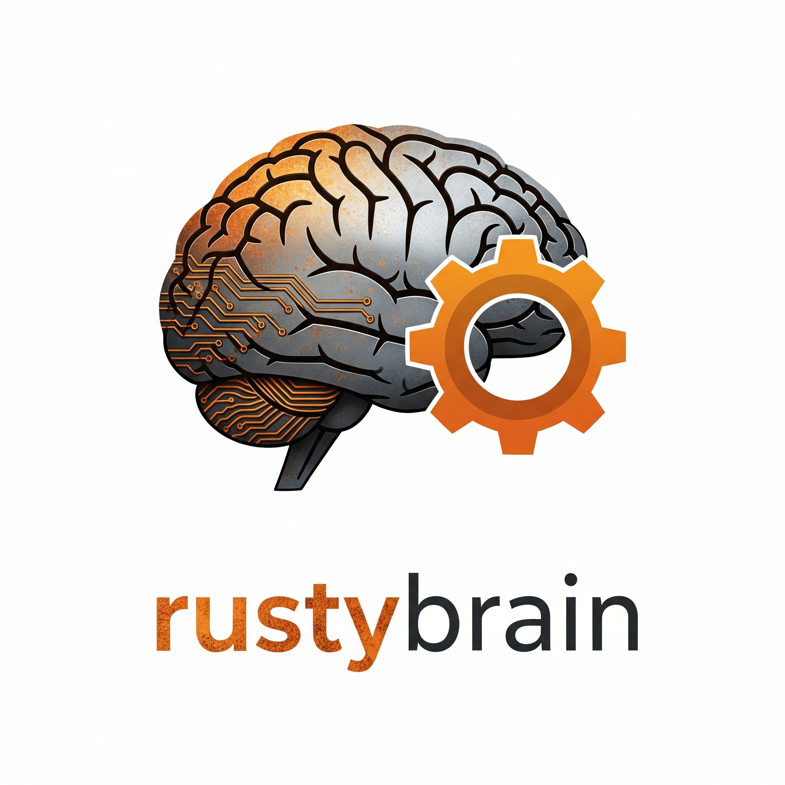

# rustybrain

<p align="center">
  
</p>

**rustybrain** is a simple neural network library written in Rust.  
It provides a minimal, educational implementation of a feedforward neural network with backpropagation, designed for learning and experimentation.

> **Inspired by the book "[Make Your Own Neural Network](https://makeyourownneuralnetwork.blogspot.com/)" by Tariq Rashid.**  
> This project follows many of the concepts and structure presented in the book. Full credit to Tariq Rashid for his clear and accessible introduction to neural networks.

## Features

- Feedforward neural network with one hidden layer
- Customizable network size and learning rate
- Sigmoid activation function
- Matrix-based math utilities
- Forward pass (`query`) and training (`train`) methods
- Unit tests for core math operations

## Example Usage
More real usage examples will come!

```rust
use rustybrain::NeuralNetwork;

fn main() {
    // Create a network with 3 input nodes, 1 hidden layer with 3 nodes, and 1 output node
    let mut nn = NeuralNetwork::new(3, 1, 3, 0.4);

    // Query the network
    let result = nn.query(vec![1.0, 2.0, 3.0]);
    println!("Query result: {:?}", result);

    // Train the network
    nn.train(vec![1.0, 2.0, 3.0], vec![0.0, 1.0, 0.0]);
    let result_after_train = nn.query(vec![1.0, 2.0, 3.0]);
    println!("Query after train: {:?}", result_after_train);
}
```

## Roadmap

Planned future improvements:

- [ ] **Error handling:** Add robust checks and clear error messages for all matrix operations.
- [ ] **Flexible activation functions:** Allow users to select or provide custom activation functions.
- [ ] **Persistence:** Implement methods to save and load network weights to/from disk.
- [ ] **Batch training:** Add support for training on batches of data for improved performance.
- [ ] **Evaluation utilities:** Provide functions for accuracy, loss calculation, and other metrics.
- [ ] **Documentation:** Expand documentation and add more usage examples.
- [ ] **Multiple hidden layers:** Support for deeper networks with more than one hidden layer.

## License

[MIT License](LICENSE.md)

---

**rustybrain** is a learning project. Contributions and suggestions are welcomed!